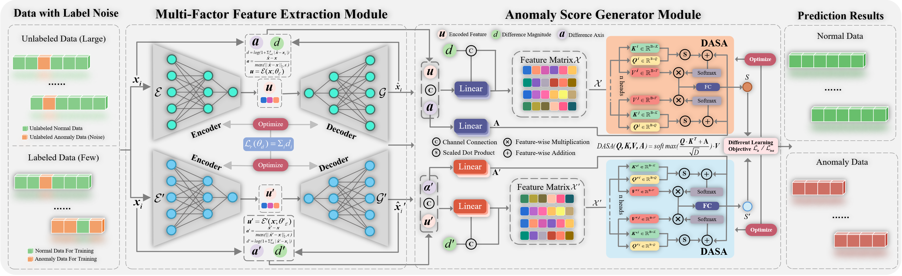

I'm a second-year graduate student from the [School of Software](https://ruanjian.nwpu.edu.cn/), [Northwestern Polytechnical University](https://www.nwpu.edu.cn), advised by Prof. HongpingGan. My research interests focus on **anomaly detection** and **weakly-supervised learning**.

---

## 🎓 Education

### Northwestern Polytechnical University
**M.S. in Software Engineering** · 2024.9 – Now

> 📄 **Purging Label Noise Contamination: A Collaborative Dual-Network with Progressive Learning for Noisy Weakly-Supervised Anomaly Detection**

CPN-Net is a novel framework for weakly-supervised anomaly detection (WSAD) under noisy label environments, leveraging a collaborative dual-network structure and progressive learning strategy to purify noisy supervision and improve detection performance.

---

### ZhengZhou University
**B.E. in Software Engineering** · 2020.9 – 2024.6

🏅 **GPA:** `3.87 / 4.0` &nbsp;|&nbsp; **Rank:** `2 / 53`

📚 **Major Courses:**

| Course | Score |
|---|---|
| Principles and Technology of Computer Network | 98 |
| Operating System | 98 |
| Probability Theory and Mathematical Statistics | 97 |
| College Physics A | 97 |
| Data Structure and Algorithm Analysis | 97 |
| Advanced Language Program Design | 96 |
| Introduction to Computer System | 96 |
| Compiler Technology | 95 |

---

## 💻 Project Experience

### 🔗 Simple Bitcoin Trading System · *Project Leader* · 2022.9 – 2022.12
- Built a blockchain system with 6 nodes supporting free trading, mining, and multi-transaction processing
- Implemented ECC key generation, Proof of Work (PoW) consensus, Merkle tree construction and transaction verification

### 📦 ZhuoYue Express · *Project Leader* · 2023.2 – 2023.6
- Full-stack delivery platform covering Android, Web and Server
- Features include order placement, QR code scanning, package management, delivery tracking and real-time status query
- 🏆 Obtained Software Copyright

### 🌐 Student Union · *Network Department Officer* · 2020.9 – 2021.9
- Assisted in planning and publicizing student union activities
- Participated in maintenance of the Zhengzhou University Student Affairs Office official website

---

## 🏅 Honors & Awards

| Year | Award |
|---|---|
| 2023, 2021 | First-class Scholarship for Excellent Student, Zhengzhou University |
| 2022 | National Inspirational Scholarship |
| 2023, 2022, 2021 | Merit Student, Zhengzhou University |

---

## 🛠️ Skills & Certificates

🗣️ **English:** CET-4 · 548 &nbsp;|&nbsp; CET-6 · 493